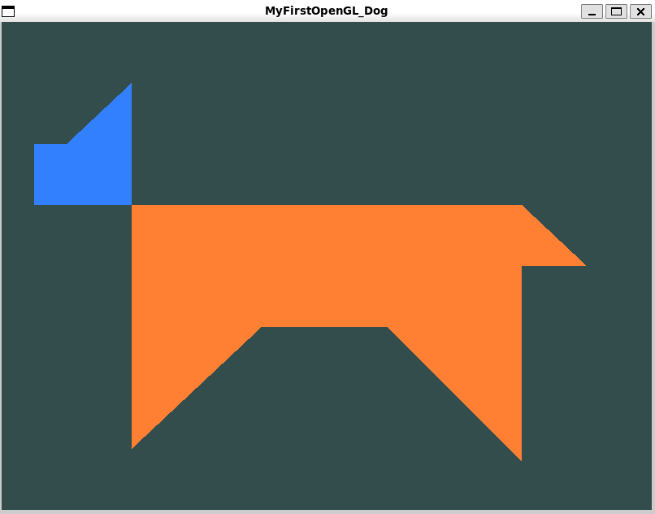

## Ejercicio 2: Modelado en Clases y Mi primer Perro o Gato en OpenGL :)

El alumno deberá **proponer una estructura de clases** que separe responsabilidades, basándose en el [Ejemplo de OpenGL](src/main.cpp). La organización del proyecto debe contemplar que los **archivos de los shaders** se encuentren en un directorio `shader`, desde donde serán leídos por la aplicación.  

**Responsabilidades sugeridas para el modelado de las clases:**  
- Leer código fuente de shader, compilar, enlazar y utilizar shaders.  (*ejem*... tal vez una clase `ShaderProgram` o un `Shader`)
- Almacenar datos de vértices, configurar VAO y VBO, y dibujar geometría.  
- Controlar el pipeline de render: limpiar buffers y dibujar.  
- Inicializar OpenGL y GLFW, crear y mantener la ventana.  
- Administrar la ejecución completa de la aplicación y el ciclo principal de render.  

Finalmente, la aplicación deberá **mostrar la silueta un perro o gato hecho con distintas figuras geométricas y usando al menos dos colores distintos** en pantalla, aprovechando la estructura de las clases previamentes organizadas y definidas. Toma de inspiración el siguiente dibujo más no lo copies completamente. 

.


La estructura del proyecto debería verse algo como: 

```
MyFirstOpenGL_Dog/
    ├── CMakeLists.txt             
    ├── shaders/                   
    │   ├── basic.vert
    │   └── basic.frag
    ├── include/                   
    │   └── Class_1.h
    │   └── Class_2.h
    └── src/                       
        ├── main.cpp
        └── Class_1.cpp
        └── Class_2.cpp
```
- **Consideraciones importantes sobre la lectura de shaders**

    En un proyecto de OpenGL,  los shaders suelen almacenarse en un directorio llamado `shaders`, cada uno con la terminación `.vert` o `frag`. Algunos ejemplos de nombres pueden ser `shade.vert`, `shader.frag` o usando la terminación `.glsl`.

    Para poder leer los datos de los shaders, considera los tipos `std::ifstream fileStream(filePath, std::ios::in)` y `std::string content((std::istreambuf_iterator<char>(fileStream)),std::istreambuf_iterator<char>())` . Asímismo, la clase `string` tiene el método  `char *source = string.c_str();` bastante útil para convertir de una `string` a un apuntador de caractéres. 

- **Consideraciones sobre el uso de varios fragment shaders**

    Para poder pintar en colores distintos, al menos para esta práctica, basta con definir un segundo shader de fragmentos con otro color. 

- **Consideraciones importantes sobre el [CMakeLists.txt](CMakeLists.txt)**

    El archivo [CMakeLists.txt](CMakeLists.txt) está en el supuesto de que la computadora tiene instaladas las bibliotecas de `glfw` y `glew`, de tal manera que en el comando `target_link_libraries` las busca en automático. En caso de error, se recomienda que las bibliotecas se instalen como `shared libraries`.  

    Recordemos que, mientras que en el comando `include_directories(${PROJECT_SOURCE_DIR}/include)` se agregan todos los *headers (.h)*, en el `CmakeLists.txt` se tiene que agregar explícitamente qué `.cpp`s se van a utilizar para generar el ejecutable en la instrucción `add_executable(${PROJECT_NAME} ${PROJECT_SOURCE_DIR}/src/main.cpp)`. 


[*Ejemplo visto en clase extraído de learnOpenGL*](https://learnopengl.com/Getting-started/Hello-Triangle)